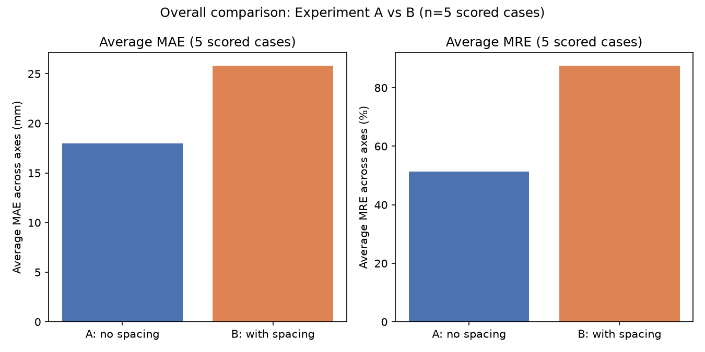
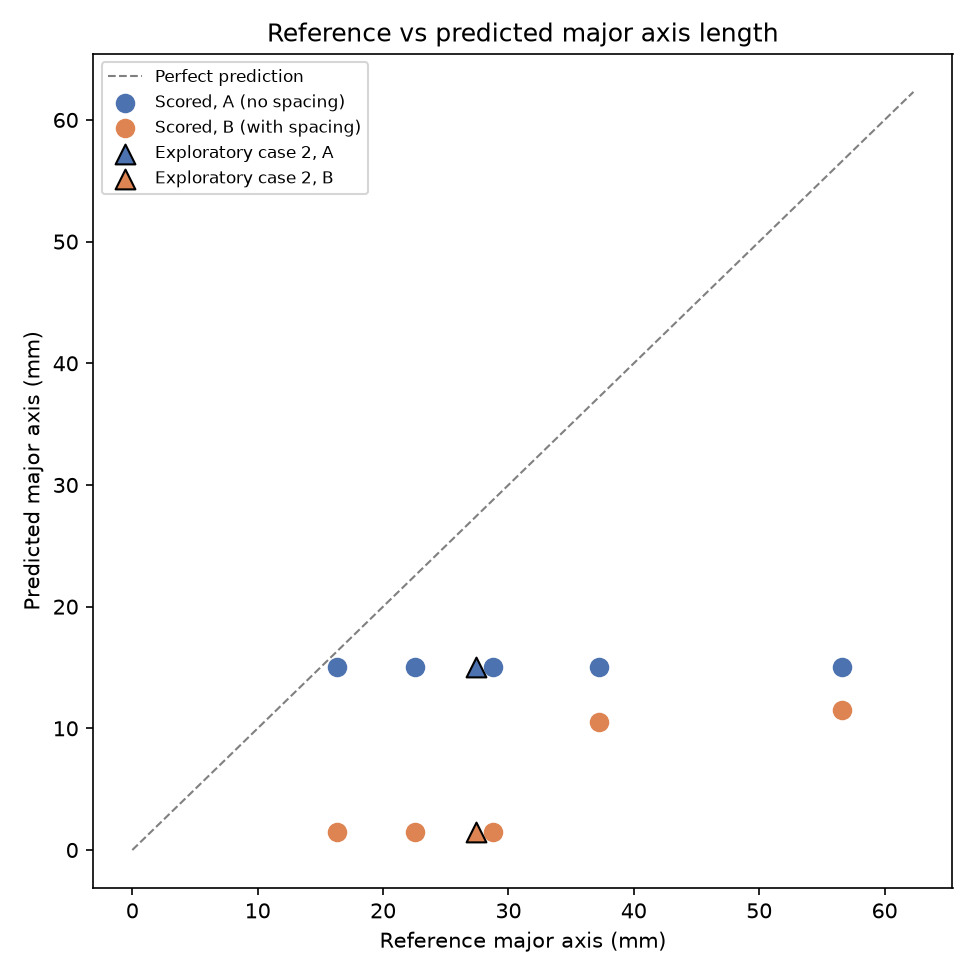

# VLM Tumor Size Estimation

A small, MedVision-inspired pilot study testing whether an open vision-language model (VLM) can estimate kidney tumor size from a CT slice, and whether telling it the image's pixel spacing helps.

## Overview

This project builds a minimal, reproducible pipeline that:
1. Loads a real tumor CT case (KiPA22) with its ground-truth segmentation mask.
2. Derives a MedVision-style reference tumor measurement (major/minor axis, in mm) directly from that mask.
3. Prompts an open medical VLM (`google/medgemma-1.5-4b-it`) to estimate the same measurement from the CT image alone — with and without being told the image's real-world pixel spacing.
4. Compares the model's predictions against the reference measurements.

It is not a reproduction of the MedVision paper's full benchmark, and not a fine-tuning or training project — it's a small, self-contained experiment built end-to-end from public data to a scored (if inconclusive) result.

## Research question

**Does giving a vision-language model the physical pixel spacing of a CT slice improve its zero-shot estimate of tumor size, compared to giving it no spacing information at all?**

## Why this matters

Tumor size (e.g. longest diameter) is a standard clinical measurement used to track disease and treatment response. A VLM reading a scan only sees pixels — it has no inherent sense of scale unless that information is supplied. Pixel spacing (how many millimeters one pixel represents) is exactly the missing conversion factor between "pixels" and "millimeters." If explicitly providing it doesn't help — or actively hurts — that's a meaningful, checkable finding about how (or whether) these models actually ground numeric answers in the image, rather than assuming spacing is trivially useful context.

## Intended Use and Boundaries

This project explores a narrow technical question — whether a VLM's zero-shot size estimate benefits from explicit pixel-spacing context — using one small, open dataset. It is a research/portfolio pilot, not a clinical tool.

**This is NOT:**
- Clinically validated in any way (no regulatory review, no clinical trial, no radiologist-adjudicated ground truth).
- For diagnosis, staging, or treatment decisions.
- A replacement for a radiologist's or a deterministic algorithm's measurement.
- Suitable for autonomous clinical reporting — every output here is a model guess, not a verified measurement.

Any real use of VLM-based measurement in a clinical or product context would require a validated ground-truth dataset, clinician review, and regulatory consideration well beyond this pilot's scope.

## Dataset: KiPA22

[KiPA22](https://kipa22.grand-challenge.org) is a kidney CT dataset with segmentation masks for four structures: kidney, kidney tumor, renal artery, renal vein. Redistributed by the MedVision project on Hugging Face ([`YongchengYAO/KiPA22`](https://huggingface.co/datasets/YongchengYAO/KiPA22), CC BY-NC-4.0) as a single ~400MB zip of 49 training cases — by far the smallest of MedVision's tumor-size-annotated datasets, which made it the practical choice for a single-machine pilot (alternatives range from ~3GB to ~96GB).

## Model: `google/medgemma-1.5-4b-it`

[MedGemma](https://huggingface.co/google/medgemma-1.5-4b-it) is Google's open, medically-tuned multimodal model (4B parameters, Gemma 3-based), trained on medical images including radiology. Chosen over larger general-purpose VLMs for being open-weight, small enough to run on a free-tier GPU, and domain-relevant — a reasonable candidate for "can an off-the-shelf medical VLM do this out of the box," with no fine-tuning involved.

## Why a VLM?

Once a segmentation mask exists, tumor size is a solved problem — deterministic geometry (fit an ellipse, apply voxel spacing) gives a reliable, reproducible measurement, and that is exactly how this project's own reference measurements are produced (below). A VLM is not needed to measure a tumor that is already segmented.

This experiment asks a different, more speculative question: **can an off-the-shelf medical VLM infer a quantitative measurement directly from the raw image and a stated scale, without ever receiving a segmentation mask?** That's a meaningfully harder task — it requires the model to locate the tumor, judge its extent, and apply a scale conversion, all from pixels alone. Using a VLM here is a deliberate experiment testing whether that's currently feasible, not an assumption that a VLM is the best or right tool for tumor measurement.

## Methodology

### Reference measurements

For each case, the kidney-tumor mask (label 4) is isolated, and the axial slice with the largest tumor area is selected. An ellipse is fit to that slice's tumor contour **in real-world (mm) space** — contour points are scaled by the voxel spacing *before* fitting, not after, since scaling by different factors per axis is not a similarity transform and can otherwise change the fitted axis lengths and orientation. This mirrors the approach used in MedVision's own `medvision_ds.__fit_ellipses` pipeline. Major/minor axis lengths in millimeters are read directly off the fitted ellipse. A lightweight, MedVision-inspired QC check (`pass_basic` vs `ellipse_outside_bbox`, based on a 0.9×/1.1× bounding-box sanity check) flags fits that may be unreliable; only `pass_basic` cases are used for scoring.

### VLM input image

CT slices are windowed with a standard abdominal soft-tissue HU window (center=40, width=400) before being shown to the model — the same normalization radiologists use to view kidneys/soft tissue on a raw Hounsfield-Unit scan. No tumor mask, outline, or bounding box is drawn on the image; the model sees only what a radiologist would see on the raw slice, so it has to both locate and size the tumor unaided.

### Experiment A — no pixel spacing

The model is shown the windowed slice and asked to estimate the tumor's major and minor axis in millimeters, with no scale information given.

### Experiment B — explicit pixel spacing

Identical prompt and image, except the case's true pixel spacing (e.g. "0.5859 mm × 0.5859 mm per pixel") is stated in the prompt.

Both experiments require a structured response: `<answer>{"major_mm": X, "minor_mm": Y}</answer>`, parsed and validated (finite, > 0) before scoring. Generation is deterministic (`do_sample=False`, `num_beams=1`, fixed `max_new_tokens`), and the model is loaded once per Colab session and reused across all cases and both experiments.

### Scored vs. exploratory cases

5 cases (IDs 0, 3, 5, 6, 8) — all `pass_basic` QC, spanning a ~3.5× range of tumor sizes (16–57mm) — form the **scored** set used for every averaged statistic. One additional case (ID 2, flagged `ellipse_outside_bbox`) is run through the identical pipeline as an **exploratory** case, reported separately and excluded from all averages, since its own reference measurement is less trustworthy.

### Evaluation metrics

- **MAE** (mean absolute error, mm): average of `|predicted − reference|` across the major and minor axes.
- **MRE** (mean relative error, %): average of `|predicted − reference| / reference` across both axes — normalizes error by tumor size, so a 5mm error means more on a 16mm tumor than a 57mm one.

## Main results (n=5 scored cases)

| | Experiment A (no spacing) | Experiment B (with spacing) |
|---|---|---|
| Average MAE | 17.96 mm | 25.81 mm |
| Average MRE | 51.3% | 87.5% |
| Cases improved by spacing | — | 0 / 5 |
| Cases worsened by spacing | — | 5 / 5 |

**In this pilot, explicitly providing pixel spacing increased error on all 5 scored cases** — both MAE and MRE roughly doubled going from Experiment A to Experiment B.

## Important observation: repetitive predictions

Looking at the raw predicted values (not just the error), a striking pattern emerges:

- **Experiment A returned the exact same prediction, `15.0mm × 10.0mm`, for all 6 cases** (all 5 scored + the exploratory case) — regardless of the case's true tumor size, which ranged from 16mm to 57mm.
- **Experiment B returned `1.5mm × 1.0mm` — exactly 1/10th of Experiment A's answer — for 4 of the 6 cases.** The remaining two cases (IDs 6 and 8) deviated from that exact ratio, giving `10.5×5.5` and `11.5×11.5` respectively.

### Interpretation (stated carefully)

This pattern is **descriptive, not a proven causal explanation**. What it does suggest: Experiment A's identical output across cases with visibly different images and different true tumor sizes is consistent with the model producing a generic, templated-looking guess rather than a measurement actually grounded in that image's content — at least under this exact zero-shot prompt and windowing setup. The suspiciously clean 10× relationship in most Experiment B cases raises the possibility that the model responded to the stated spacing value by scaling its answer down by a fixed factor rather than performing a genuine unit conversion — but the two cases that don't follow this exact ratio argue against a single deterministic rule, and no mechanism has been verified (e.g. by inspecting attention, trying reworded prompts, or testing on more cases).

**We do not claim that pixel spacing is generally harmful to VLM tumor-size estimation.** The honest summary is narrower: in this small pilot, explicit spacing increased error across all five scored cases, and the largely repetitive predictions across both experiments suggest weak image-grounded quantitative measurement under the specific zero-shot prompting setup tested here — not a general result about MedGemma, spacing information, or VLMs.

## Ways This Could Fail in Practice

Framed as product risk, grounded in what this pilot actually observed:

- **Plausible-looking but ungrounded measurements.** A structured, well-formatted `{"major_mm": X, "minor_mm": Y}` answer looks trustworthy regardless of whether it reflects the actual image — as seen here, where Experiment A returned an identical answer for every case.
- **Repetitive/default numeric answers.** A model can fall back to a generic-looking guess rather than a per-image measurement, as the identical `15×10mm` output across all 6 cases suggests may have happened.
- **Misinterpreting scale information.** Providing pixel spacing did not reliably act as a unit-conversion factor here; in most cases the answer changed by a suspiciously clean 10× rather than in a way explainable by the stated spacing.
- **Measuring the wrong structure.** With no mask or outline provided, nothing in this pipeline confirms the model was actually looking at the tumor rather than the kidney, an adjacent structure, or nothing specific at all.
- **False precision from structured output.** Forcing a numeric JSON answer can manufacture an appearance of precision (e.g. "11.5mm") that isn't backed by genuine image-grounded measurement.
- **Non-generalization.** Results come from one organ (kidney), one dataset (KiPA22), one model, and one prompt — performance on other organs, datasets, imaging modalities, or scanners is untested and cannot be assumed.
- **Misplaced trust.** The biggest practical risk is a downstream user treating any of these numbers as clinically reliable simply because they're numeric and confidently formatted.

## Limitations

- **n=5 scored cases** — a pilot sample, not a statistically powered study. No claim here generalizes beyond this specific setup.
- Single model (`medgemma-1.5-4b-it`), single prompt phrasing, single windowing/normalization choice, single dataset (KiPA22, kidney tumors only) — all of these are unexplored variables that could change the outcome.
- Reference measurements come from an ellipse fit to a single 2D slice, not a clinician's read — a reasonable proxy, but not clinical ground truth.
- The repetitive-prediction pattern is an observation from 6 cases; it has not been mechanistically explained or verified with larger-scale or ablation testing.
- Zero-shot only — no fine-tuning, no chain-of-thought reasoning was requested or relied upon (only the structured final answer was scored, though full raw responses were saved for transparency).

## What I Would Ship

Based on this pilot's evidence, **I would not ship zero-shot VLM tumor measurement as the primary measurement engine.** Where a segmentation mask is available (or obtainable), deterministic geometry is the safer, more reliable, and fully auditable quantitative path — it's what this project itself uses for reference measurements, and nothing here outperforms it.

A VLM may still have a legitimate role, but as a **supporting layer rather than the measurement source of truth** — for example: generating a plain-language explanation of a measurement already computed deterministically, assisting a clinician's workflow (e.g. drafting a report section for review), or flagging cases where its own estimate disagrees sharply with a deterministic measurement for human follow-up. This is a product decision driven by observed reliability in this pilot, not a claim that VLMs are inherently incapable of this task — a different model, prompt, fine-tuning approach, or larger evaluation could change this conclusion.

## Production Metrics and Governance

If a system like this moved toward production, I would track:

- **Accuracy**: MAE / MRE against a trusted reference measurement.
- **Reliability**: parse success/failure rate, and rate of repeated/default-looking answers (this pilot's biggest red flag).
- **Safety net**: disagreement rate against deterministic or clinician measurements; clinician override/review rate.
- **Operations**: latency per case, compute/API cost per case.
- **Drift**: performance stability across sites, scanners, and patient populations over time.
- **Auditability**: full logging of raw model output, prompt version, and model/version used per prediction — so any measurement can be traced back to exactly what produced it.

## Reproducibility

Requires Python 3.11+ (project developed on 3.14.6) for all local steps; VLM inference requires a Colab GPU session (free T4 tier is sufficient) since it isn't run locally.

```bash
python -m venv .venv
source .venv/bin/activate
pip install -r requirements.txt
```

Pipeline, in order:
1. `src/load_sample.py` — downloads KiPA22's `train.zip` (~400MB, cached), extracts one case, prints its fields, saves a sanity-check overlay.
2. `src/measure_tumor.py` — fits the reference ellipse for that one case, reports major/minor axis in mm.
3. `src/batch_measure.py` — repeats the measurement across a 10-case batch, applies the QC flag, writes `results/batch_measurements.csv`.
4. `src/analyze_qc.py` — diagnoses the QC-flagged cases (`results/qc_analysis.csv`, `outputs/qc_analysis/`).
5. `src/prepare_vlm_input.py` / `src/prepare_vlm_batch.py` — window and export the CT slice(s) shown to the VLM, plus a metadata/zip bundle for Colab upload.
6. `notebooks/milestone5_vlm_case0.ipynb` / `notebooks/milestone6_vlm_batch5.ipynb` — run in Google Colab (free T4 GPU) to perform the actual VLM inference; requires a Hugging Face token supplied via Colab secrets (never hardcoded) and acceptance of MedGemma's usage terms.
7. `src/analyze_vlm_batch5.py` — analyzes the completed VLM batch results, produces the comparison table and figures below.

## Repository structure

```
src/                    Analysis/preprocessing scripts (run locally, no GPU needed)
notebooks/              Colab notebooks (VLM inference; needs a GPU)
data/                   Downloaded/extracted case data (gitignored — not committed)
results/                CSV outputs: reference measurements, QC analysis, VLM predictions
outputs/                Figures, windowed images, raw model responses
  ├── batch_examples/       Example reference-measurement visualizations
  ├── qc_analysis/          QC diagnostic visualizations
  ├── vlm_case0/             Milestone 5 single-case VLM smoke test
  └── vlm_batch5/            Milestone 6 batch VLM results + Milestone 7 analysis
      └── analysis/              Final comparison figures and findings (below)
```

## Key figures

- `outputs/vlm_batch5/analysis/overall_avg_comparison.png` — average MAE/MRE, Experiment A vs B
- `outputs/vlm_batch5/analysis/mae_per_case.png` — per-case MAE, A vs B
- `outputs/vlm_batch5/analysis/mre_per_case.png` — per-case MRE, A vs B
- `outputs/vlm_batch5/analysis/ref_vs_pred.png` — reference vs. predicted tumor size, all cases




## Conclusion

In this small pilot, an off-the-shelf medical VLM's zero-shot tumor-size estimates did not benefit from being told the CT slice's pixel spacing — error increased on every scored case — and the largely repetitive predictions across both experiments suggest the model's answers were only weakly grounded in each image's actual content under this prompting setup. The pipeline built here (reference measurement → windowed VLM input → structured prediction → scored comparison) is reusable for a larger, better-powered follow-up before drawing any general conclusion.

## Ownership / Role

I defined this project end to end: selected the research question, chose the dataset and model, and designed the A/B experiment (scored vs. exploratory cases, MAE/MRE metrics, deterministic generation settings). I built and validated the reference-measurement and QC workflow, inspected the raw model outputs for failure patterns, and interpreted the results — including deciding how far the findings could and couldn't be generalized. I used AI coding assistance during implementation, but reviewed, tested, and validated the methodology, code, outputs, and conclusions myself; the analysis and product judgments in this README are mine.
